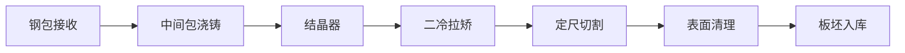

## 1. 产品概述

钢铁厂连铸车间板坯业务管理系统，用于连铸车间全流程钢水、浇铸和切割的生产管理与监控。系统覆盖钢包接收、中间包浇铸、结晶器、二冷拉矫、定尺切割、表面清理、板坯入库七大模块，实现连铸生产全过程的数字化管理与智能化监控。

- 主要用途：连铸车间生产调度、质量管控、数据采集与分析
- 目标用户：连铸车间操作工、班组长、工艺工程师、生产管理人员
- 产品价值：提升连铸生产过程可视化、质量追溯、生产效率提升

## 2. 核心功能

### 2.1 用户角色

| 角色 | 登录方式 | 核心权限 |
|------|----------|----------|
| 操作工 | 工号登录 | 数据录入、状态监控、操作执行 |
| 班组长 | 工号登录 | 生产调度、数据审核、报表查看 |
| 工艺工程师 | 工号登录 | 参数配置、工艺分析、质量追溯 |
| 管理员 | 账号登录 | 系统配置、用户管理、权限分配 |

### 2.2 功能模块

1. **钢包接收**：钢包钢水接收登记、温度检测、钢水成分录入
2. **中间包浇铸**：中间包温度监控、保护渣加入记录、液位控制
3. **结晶器**：结晶器液位监控、振动参数设置、振动状态监控
4. **二冷拉矫**：二冷水配比、拉速控制、铸坯鼓肚检测
5. **定尺切割**：火焰定尺切割、切割长度设置、切割计数
6. **表面清理**：板坯表面清理、缺陷记录、清理质量判定
7. **板坯入库**：低倍偏析检验、板坯堆垛标识、入库登记

### 2.3 页面详情

| 页面名称 | 模块名称 | 功能描述 |
|----------|----------|----------|
| 总览仪表盘 | 首页 | 生产概览、关键指标、实时告警 |
| 钢包接收 | 钢包接收 | 钢包编号、钢种、温度、重量、接收时间 |
| 中间包浇铸 | 中间包浇铸 | 温度曲线、保护渣加入量、开浇/停浇控制 |
| 结晶器 | 结晶器 | 液位实时曲线、振动频率、振幅、振动状态 |
| 二冷拉矫 | 二冷拉矫 | 各区水量、拉速设定、鼓肚检测报警 |
| 定尺切割 | 定尺切割 | 切割长度、切割计数、火焰状态 |
| 表面清理 | 表面清理 | 清理记录、缺陷类型、清理质量判定 |
| 板坯入库 | 板坯入库 | 低倍偏析检验、堆垛位置、入库记录 |

## 3. 核心流程

钢水从钢包接收开始，经过中间包浇铸、结晶器成型、二冷拉矫、定尺切割、表面清理，最终完成板坯入库，形成完整的连铸生产流程。

## 4. 用户界面设计

### 4.1 设计风格
- **主色调**：深蓝色系（工业蓝 #1e3a5f、#2563eb）
- **辅助色**：橙色告警（#f97316）、绿色正常（#22c55e）、红色异常（#ef4444）
- **背景色**：深灰工业风（#0f172a、#1e293b）
- **按钮风格**：扁平化，直角或微圆角，工业感强
- **字体**：等宽字体用于数据显示，无衬线字体用于标题
- **布局风格**：侧边栏导航 + 顶部状态栏 + 主内容区卡片式布局
- **图标风格**：线性图标，工业设备风格

### 4.2 页面设计概述

| 页面名称 | 模块名称 | UI 元素 |
|----------|----------|---------|
| 总览仪表盘 | 首页 | 深色主题、卡片式布局、数据卡片、实时趋势图、告警列表 |
| 钢包接收 | 钢包接收 | 数据表格、状态标签、表单录入、状态指示 |
| 中间包浇铸 | 中间包浇铸 | 温度曲线图、数据面板、操作按钮、实时数据 |
| 结晶器 | 结晶器 | 液位监控图、振动参数面板、状态指示 |
| 二冷拉矫 | 二冷拉矫 | 二冷区示意图、拉速控制滑块、鼓肚检测报警 |
| 定尺切割 | 定尺切割 | 切割示意图、计数器、火焰状态指示 |
| 表面清理 | 表面清理 | 清理记录表格、缺陷类型选择、质量判定 |
| 板坯入库 | 板坯入库 | 检验结果、堆垛示意图、入库记录 |

### 4.3 响应式
- 桌面端优先设计，适配 1920×1080 及以上分辨率
- 支持平板端侧边栏可折叠，适配触摸操作优化
- 关键数据区域固定显示，确保生产监控大屏展示

### 4.4 工业数据可视化
- 实时数据更新动画效果
- 告警闪烁效果，异常状态高亮
- 设备状态指示灯
- 趋势曲线图展示
- 工艺流程示意图
- 数据仪表盘
