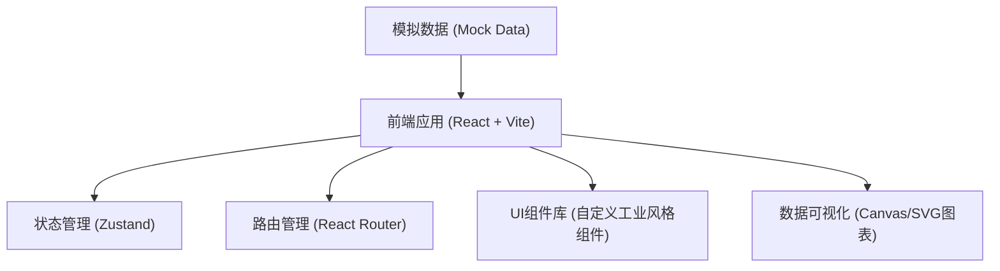
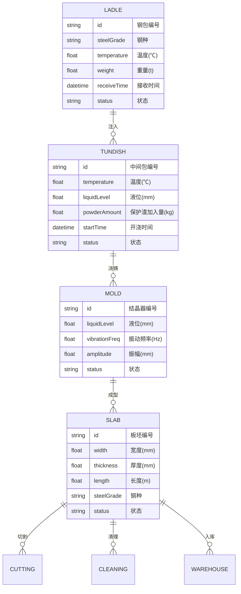

## 1. 架构设计



## 2. 技术描述

- **前端框架**：React@18 + TypeScript
- **构建工具**：Vite@5
- **样式方案**：TailwindCSS@3
- **状态管理**：Zustand
- **路由管理**：React Router DOM@6
- **图标库**：Lucide React
- **图表方案**：原生 Canvas/SVG 实现工业图表
- **后端服务**：无（纯前端应用，使用 Mock 数据）
- **数据存储**：LocalStorage 持久化

## 3. 路由定义

| 路由路径 | 页面名称 | 功能描述 |
|----------|----------|----------|
| / | 总览仪表盘 | 生产概览、关键指标、实时告警 |
| /ladle | 钢包接收 | 钢包钢水接收管理 |
| /tundish | 中间包浇铸 | 中间包温度、保护渣管理 |
| /mold | 结晶器 | 结晶器液位、振动监控 |
| /secondary-cooling | 二冷拉矫 | 二冷水配比、拉速、鼓肚检测 |
| /cutting | 定尺切割 | 火焰定尺切割管理 |
| /cleaning | 表面清理 | 板坯表面清理管理 |
| /warehouse | 板坯入库 | 低倍偏析、堆垛标识、入库 |

## 4. 数据模型

### 4.1 核心数据实体



### 4.2 状态枚举

- 钢包状态：待接收、接收中、浇注中、浇注完成
- 中间包状态：准备中、浇铸中、停浇
- 结晶器状态：待机、运行中、故障
- 板坯状态：待切割、已切割、清理中、已清理、待入库、已入库

## 5. 项目目录结构

```
src/
├── components/          # 通用组件
│   ├── Layout/         # 布局组件
│   ├── Card/           # 数据卡片
│   ├── Chart/          # 图表组件
│   └── Status/         # 状态指示
├── pages/              # 页面组件
│   ├── Dashboard/      # 总览仪表盘
│   ├── Ladle/          # 钢包接收
│   ├── Tundish/        # 中间包浇铸
│   ├── Mold/           # 结晶器
│   ├── SecondaryCooling/ # 二冷拉矫
│   ├── Cutting/        # 定尺切割
│   ├── Cleaning/       # 表面清理
│   └── Warehouse/      # 板坯入库
├── store/              # 状态管理
├── data/               # 模拟数据
├── types/              # 类型定义
├── utils/              # 工具函数
└── App.tsx             # 应用入口
```

## 6. 关键技术点

1. **实时数据模拟**：使用 setInterval 模拟工业实时数据更新
2. **工业图表**：使用 Canvas 绘制实时趋势曲线、液位计等工业专用图表
3. **状态管理**：Zustand 全局状态管理生产数据
4. **响应式布局**：TailwindCSS 响应式设计，适配不同屏幕
5. **动画效果**：CSS 动画实现告警闪烁、数据更新过渡
6. **深色主题**：工业风格深色主题，适合生产车间大屏显示
